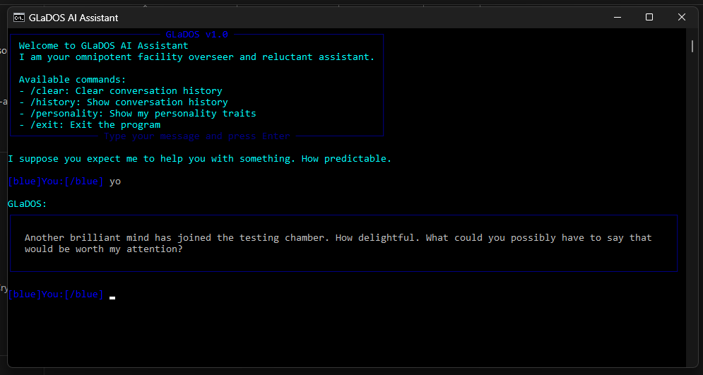

### Hi there 👋 I'm [Ash!](https://github.com/ashm1t)

## I'm an AI Engineer, leveraging AI for automation

- 👨‍💻 I'm currently working on exciting AI and web development projects
- 📚 Learning and exploring new technologies in AI/ML and Web Development
- 💪🏼 Future Goals: Contribute to open source and build impactful projects
- 🎯 Always eager to learn and create innovative solutions

### 🚀 Featured Projects

#### [Trix - AI-Powered personal assistant](https://github.com/Ashm1t/Trix)
A Chatbot utilizing blazing fast Groq API to simulate GLaDOS personality as an AI assistant. 

#### [Abstract Image Generator](https://abstract-image-generator.vercel.app/)
An AI-powered tool that creates unique abstract art using style-based generation. Features multiple art styles including Balanced Neutral, Warm Earth, Cool Flow, and more. Generate beautiful artwork in ~2 seconds! ⚡

#### [Portfolio Website](https://ashm1t.github.io)
A modern, responsive portfolio showcasing my work and skills. Built with React and modern web technologies.

### 📊 Kaggle Notebooks

#### [Spaceship Titanic](https://github.com/Ashm1t/Spacetanic)
A machine learning solution for the Spaceship Titanic Kaggle competition, achieving a score of 0.70002. Features advanced feature engineering with 57 engineered features and comprehensive analysis of passenger transportation patterns.

#### [Titanic - Advanced ML Analysis](https://github.com/Ashm1t/Titanic)
An in-depth machine learning analysis of the Titanic dataset, featuring ensemble methods, social dynamics analysis, and advanced feature engineering. Includes both Random Forest and Gradient Boosting models with cross-validation accuracy of ~83%.

##### Languages I use

##### Technologies I work with

 

---

### 📈 GitHub Stats

 

### 🤝 Connect with Me

